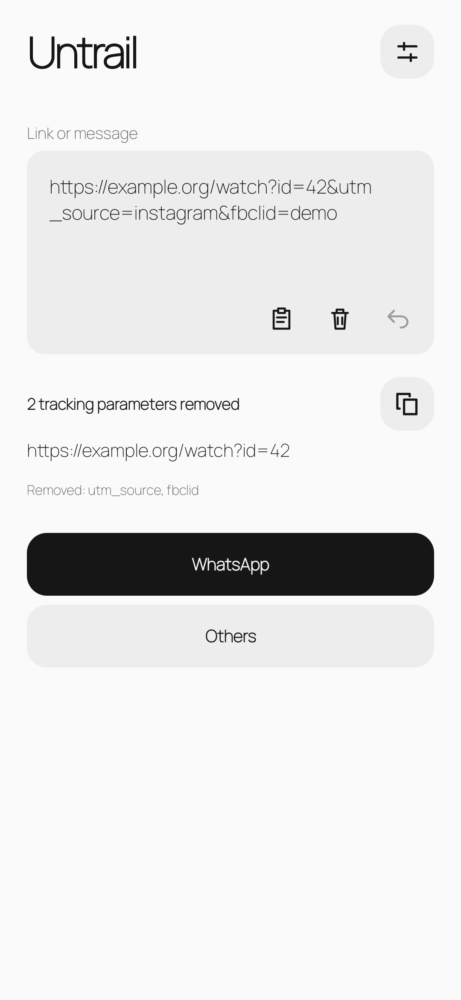
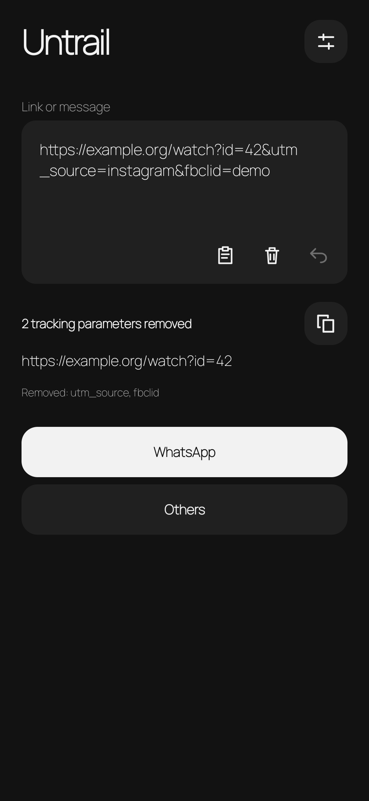

# Untrail

Clean links before sharing them. A small, offline Android app that removes known tracking parameters, unwraps supported redirects, and leaves the URL ready to send.

<p align="center">
  
  
</p>

## Use it

Install an APK from [Releases](https://github.com/SriCharanGundla/Untrail/releases) on **Android 12 or newer**.

- Share a link to Untrail's **WhatsApp** target to open WhatsApp's recipient picker, or **Others** to choose another app. Only URLs are forwarded; accompanying promotional text is removed.
- Open Untrail to paste, preview, copy, or share. Multiple links are supported.
- Choose **Clean link** in supported text-selection menus to clean selected text in place.
- Settings offers **Light / Dark / System** appearance and optional experimental **WhatsApp draft cleaning**, with a seven-second Undo. Enable its accessibility service to use it. Automatic editing is limited to recognized WhatsApp composers; compatibility varies by app version.

## What gets cleaned?

Common campaign parameters (`utm_*`, `fbclid`, and similar), plus rules for Instagram, Facebook, YouTube, TikTok, X, Spotify, and Amazon. Supported Facebook/Google redirects are unwrapped locally; Amazon product URLs and affiliate parameters are simplified.

Retained parameters, timestamps, fragments, and recognized signed/token-bearing links are preserved. Unknown trackers and opaque short links such as `amzn.to` can remain. No Internet permission, analytics, accounts, or link-history database. Clipboard access occurs when you press Paste or Copy. Draft cleaning reads the focused WhatsApp composer only and never sends messages.

## Develop

Native Java and Android Views, with no third-party runtime libraries. Use **JDK 17**, Android SDK **36**, and Build Tools **36.0.0**. Set `ANDROID_HOME` or configure your SDK location in the ignored `local.properties` file.

```sh
./gradlew :app:assembleDebug
adb install -r app/build/outputs/apk/debug/app-debug.apk
```

Run the standalone cleaner and draft-policy tests (only a JDK is needed):

```sh
bash scripts/test.sh
```

The 109 checks cover link preservation, redirects, long inputs, typing boundaries, Undo, and cursor mapping. On-device checks should also cover sharing, text selection, settings navigation, and accessibility behavior. The screenshots show the current development UI in light and dark mode, with system bars hidden and the same fictional example link.

## Release

Open **Actions → Release APK → Run workflow**, select the revision, and enter a version such as `0.1.1`. The workflow tests, builds, verifies, signs, and publishes `Untrail-v0.1.1.apk` with SHA-256 checksums and a matching Git tag. No source edit is needed to set the release version.

Versions use `X.Y.Z`; minor/patch must be at most 999. Android's version code is `X × 1,000,000 + Y × 1,000 + Z`. Existing versions cannot be overwritten and each new version must increase.

Repository signing secrets: `RELEASE_KEYSTORE_BASE64`, `RELEASE_STORE_PASSWORD`, `RELEASE_KEY_ALIAS`, and `RELEASE_KEY_PASSWORD`. Maintain the same private signing key for future updates; never commit it. Fork maintainers must provide their own secrets. Release APKs use a different key from local debug builds, so switching from a debug build requires uninstalling it first.

## Credits

Manrope is bundled under the [SIL Open Font License](app/src/main/assets/OFL-Manrope.txt). The Gradle wrapper is from Gradle (Apache-2.0).
